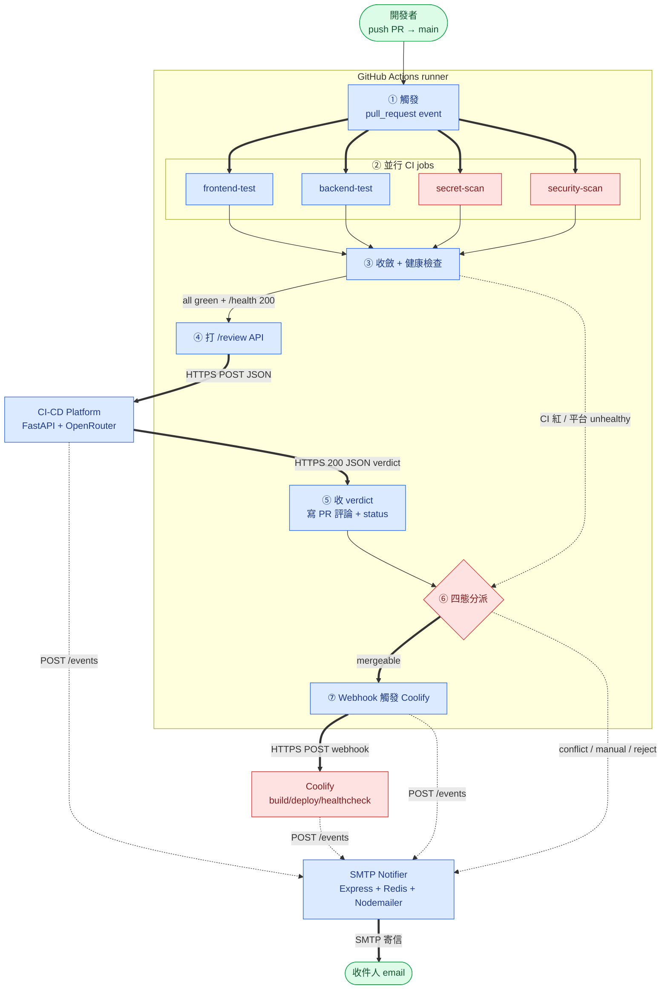
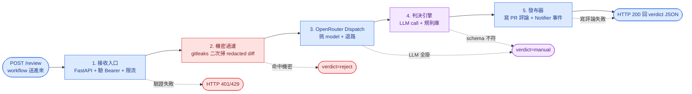

# Auto-CI-CD Process Design v1.1

> **本檔定位** — workflow-v1.1.md 講 **what & why**(三服務拆分、四態 verdict、保護路徑、通知策略)。本檔講 **how**:從「使用者 push PR」到「Coolify 部署完成 → 寄信」,**每一個 stage 的觸發、技術、Input/Output 格式、資料怎麼傳到下一站**。
>
> **三系統角色**(技術選型):
> - **GitHub Actions(runner)** — workflow 引擎,跑 CI / 打 API / 判 verdict / 呼 Coolify webhook
> - **CI-CD Platform**(自建 Python service,Coolify 部署)— `/health` + `/review` HTTP endpoint
> - **SMTP Notifier**(自建 Node/Python service,Coolify 部署)— 收三方 webhook + Redis 暫存 + Nodemailer 寄信

---

## 一、整體系統流程圖



**8 個 stage 的最小單位資料流**:`PR event → CI results → /review payload → verdict JSON → merge action → Coolify webhook → deploy status → SMTP event → email`。

---

## 二、技術棧速覽

| Stage | 跑在哪 | 主要技術 | Input 來源 | Output 去處 |
| --- | --- | --- | --- | --- |
| ① 觸發 | GitHub 平台 | GitHub Actions `on:` event | GitHub PR API | runner |
| ② CI jobs | GHA runner(ubuntu-latest) | node / python / java / gitleaks / semgrep / trivy | repo source | runner step output + artifact |
| ③ 收斂 | runner | bash + `needs:` 收集 `*.result` | 各 job 結果 | step output |
| ④ /review | runner | `curl` HTTPS POST + `jq` | runner | CI-CD Platform |
| ⑤ Verdict 回寫 | runner | `gh api` / `actions/github-script` | CI-CD Platform 回應 | GitHub PR API |
| ⑥ 分派 | runner | bash `case` + `gh pr {merge,comment,ready,close}` | step ⑤ verdict | GitHub PR API |
| ⑦ CD trigger | runner | `curl` Coolify webhook | merged commit SHA | Coolify |
| ⑧ Notify | Notifier 服務 | Express + Redis + Nodemailer | GHA / CI-CD Platform / Coolify webhook | SMTP / email |

---

## 三、Step-by-step:狀態流 + 資料流 + I/O

### Stage ① — PR push 觸發

**技術**:GitHub Actions `on:` event subscription(`.github/workflows/ci-cd.yml`)。

**觸發條件**:

```yaml
on:
  pull_request:
    branches: [main]
    types: [opened, synchronize, reopened]
  push:
    branches: [main]   # merge 後再跑一次確認

concurrency:
  group: ci-cd-${{ github.event.pull_request.number || github.ref }}
  cancel-in-progress: true
```

**Input**(GitHub 平台送進 runner 的 event payload,節錄):

```jsonc
{
  "action": "opened",
  "pull_request": {
    "number": 123,
    "head": { "sha": "abc1234", "ref": "feat/login" },
    "base": { "ref": "main" },
    "user": { "login": "jiaye" },
    "title": "(AI) feat: 加 SSO login",
    "body": "..."
  },
  "repository": { "full_name": "Dafon-IT/CRM-Backend" },
  "installation": { "id": 45678901 }
}
```

**Output**:runner 啟動,每個 job 拿到 `${{ github.event.pull_request.number }}` / `${{ github.sha }}` 等 context。

**傳到下一站**:runner 內 4 個 CI jobs 並行啟動(無 `needs:` 依賴)。

---

### Stage ② — 並行 CI jobs(4 個)

**並行性**:互無 `needs:` 依賴,GitHub Actions 預設並行。

#### 2.1 `frontend-test`

| 項 | 內容 |
| --- | --- |
| 技術 | `actions/setup-node@v4` + `npm ci` / `npm run lint` / `npm test` / `npm run build` / `npm audit` |
| Input | `repository` checkout(預設淺 clone)|
| Output | step `result: success/failure` + artifact `frontend-coverage/` |

#### 2.2 `backend-test`(Python / Node / Java 三選一)

| 項 | 內容 |
| --- | --- |
| 技術 | Python:`ruff` + `mypy` + `pytest` + alembic round-trip;Node:`npm test` + prisma migrate;Java:`mvn -B verify` + Flyway migrate |
| 額外服務 | `services.postgres: postgres:17.2`(migration round-trip 需要)|
| Input | repo source + `DATABASE_URL` env(指 service postgres)|
| Output | step `result` + artifact `coverage.xml` / `target/dependency-check-report.html` |

#### 2.3 `secret-scan` 🔴

| 項 | 內容 |
| --- | --- |
| 技術 | `gitleaks/gitleaks-action@v2`(`.gitleaks.toml` 設定)|
| Input | `actions/checkout@v4 with: fetch-depth: 0`(需完整歷史)|
| Output | step `result: success/failure`;命中 → workflow 端步驟 ⑥ 走 `reject` |

#### 2.4 `security-scan` 🔴

| 項 | 內容 |
| --- | --- |
| 技術 | `returntocorp/semgrep-action@v1`(`p/security-audit + p/owasp-top-ten` config)+ `trivy fs`(filesystem scan)|
| Input | repo source |
| Output | step `result` + `semgrep.sarif` artifact + step outputs `has_high_cve` / `has_medium_cve` |

**Output 共同格式**(供 Stage ③ 收斂讀):

```text
needs.<job-id>.result          ∈ {success, failure, cancelled, skipped}
needs.<job-id>.outputs.<key>   ← job 自設,例 has_high_cve=true
```

**傳到下一站**:4 個 job 結束 → `ai-review` job 因 `needs: [...]` + `if: always()` 啟動。

---

### Stage ③ — CI 收斂 + CI-CD Platform 健康檢查

**技術**:bash + `curl` + step outputs。在 `ai-review` job 內。

**3.1 收 CI 結果**(`step: collect`):

```yaml
- id: ci
  run: |
    echo "front=${{ needs.frontend-test.result }}"   >> $GITHUB_OUTPUT
    echo "back=${{ needs.backend-test.result }}"     >> $GITHUB_OUTPUT
    echo "secret=${{ needs.secret-scan.result }}"    >> $GITHUB_OUTPUT
    echo "sec=${{ needs.security-scan.result }}"     >> $GITHUB_OUTPUT
    echo "high_cve=${{ needs.security-scan.outputs.has_high_cve }}" >> $GITHUB_OUTPUT
```

**Input**:4 個 needs job 的 result + outputs。
**Output**(step output)：

```text
front=success|failure
back=success|failure
secret=success|failure
sec=success|failure
high_cve=true|false
```

**3.2 CI 紅燈 fast-path**(不打 CI-CD Platform,直接決 verdict):

```yaml
- id: ci-fail
  if: |
    steps.ci.outputs.secret == 'failure'
    || steps.ci.outputs.high_cve == 'true'
    || steps.ci.outputs.front == 'failure'
    || steps.ci.outputs.back == 'failure'
  run: |
    if [[ "${{ steps.ci.outputs.secret }}" == "failure" \
       || "${{ steps.ci.outputs.high_cve }}" == "true" ]]; then
      echo "verdict=reject" >> $GITHUB_OUTPUT
    else
      echo "verdict=conflict" >> $GITHUB_OUTPUT
    fi
```

| CI 訊號 | verdict | 直接跳到 |
| --- | --- | --- |
| secret-scan fail | `reject` | Stage ⑥ |
| security-scan high CVE | `reject` | Stage ⑥ |
| security-scan medium CVE | `conflict` | Stage ⑥ |
| frontend / backend fail | `conflict` | Stage ⑥ |

**3.3 全綠 → 打 `/health`**:

```yaml
- id: health
  if: steps.ci-fail.outcome == 'skipped'
  env:
    PLATFORM_URL: ${{ vars.CICD_PLATFORM_URL }}
  run: |
    code=$(curl -sS -o /tmp/h.json -w "%{http_code}" \
                --connect-timeout 5 --max-time 10 \
                "$PLATFORM_URL/health" || echo "000")
    [[ "$code" == "200" ]] \
      && echo "healthy=true"  >> $GITHUB_OUTPUT \
      || echo "healthy=false" >> $GITHUB_OUTPUT
```

| `/health` 回應 | Output | 下一站 |
| --- | --- | --- |
| HTTP 200 + `{"status":"ok"}` | `healthy=true` | Stage ④ /review |
| 非 200 / timeout / connection error | `healthy=false` | Stage ⑥(verdict=manual 降級) |

---

### Stage ④ — 打 CI-CD Platform `/review`

**技術**:`curl` HTTPS POST + `jq` 組 JSON。

**4.1 送出前準備**:

```yaml
- name: Prepare diff
  if: steps.health.outputs.healthy == 'true'
  run: git diff origin/main...HEAD > /tmp/pr.diff
- name: Redact secrets (第二道)
  if: steps.health.outputs.healthy == 'true'
  run: gitleaks protect --staged /tmp/pr.diff
```

**4.2 POST `/review`**(L3 隱形濾網:Bearer + 4 個 `X-DF-*` 自訂 header,詳見 [cicd-platform-plan.md](./cicd-platform-plan.md)):

```yaml
- id: review
  if: steps.health.outputs.healthy == 'true'
  env:
    PLATFORM_URL: ${{ vars.CICD_PLATFORM_URL }}
    PLATFORM_KEY: ${{ secrets.CICD_PLATFORM_KEY }}
  run: |
    curl -X POST "$PLATFORM_URL/review" \
      -H "X-DF-Author:       ${{ github.event.pull_request.user.login }}" \
      -H "X-DF-Author-Email: ${{ github.event.pull_request.user.email }}" \
      -H "X-DF-Repo:         ${{ github.repository }}" \
      -H "X-DF-PR:           ${{ github.event.pull_request.number }}" \
      -H "X-DF-Commit-SHA:   ${{ github.sha }}" \
      -H "Authorization: Bearer $PLATFORM_KEY" \
      -H "Content-Type: application/json" \
      --max-time 300 \
      -d "$(jq -n \
            --arg sha "${{ github.sha }}" \
            --argjson pr ${{ github.event.pull_request.number }} \
            --arg repo "${{ github.repository }}" \
            --arg diff "$(cat /tmp/pr.diff)" \
            --arg body "${{ github.event.pull_request.body }}" \
            '{commit_sha:$sha, pr_number:$pr, repo:$repo,
              diff:$diff, pr_body:$body,
              rules_ref:"99-code-review/v1.0"}')" \
      > /tmp/review.json
    echo "verdict=$(jq -r .verdict /tmp/review.json)" >> $GITHUB_OUTPUT
```

**4 個 X-DF-* header 全部來自 GHA context,不需要新增任何 GitHub Secret / Variable / Organisation 設定**。

**Input(POST body)**:

```jsonc
{
  "commit_sha":  "abc1234",
  "pr_number":   123,
  "repo":        "Dafon-IT/CRM-Backend",
  "diff":        "diff --git a/...\n@@ ...",   // 已過 gitleaks redact
  "pr_body":     "PR 描述文字",
  "rules_ref":   "99-code-review/v1.0"
}
```

**Output(同步回應,timeout 5 分鐘)**:

```jsonc
{
  "verdict":     "mergeable | conflict | manual | reject",
  "verdict_zh":  "可以合併 | 衝突 | 人工介入 | 不能合併",
  "reason":      "一句話原因",
  "summary":     "整體評語(會貼到 PR 評論)",
  "model_used":  "anthropic/claude-opus-4-7",
  "findings": [
    {
      "severity":   "blocker | major | minor | nit",
      "file":       "src/foo.ts",
      "line":       42,
      "rule_id":    "99/04-lint-checklist#3",
      "suggestion": "改成 …"
    }
  ],
  "cost_tokens": 12345
}
```

**HTTP 錯誤對照**:

| HTTP | runner 的行為 |
| --- | --- |
| 401 / 403 | step fail-fast,verdict 視同 `manual`(token 設錯通知 tech-lead) |
| 429 | 重試 2 次間隔 30s,仍失敗 → `manual` |
| 5xx / timeout | 重試 2 次,仍失敗 → `manual` |

**傳到下一站**:`/tmp/review.json` 留檔給 Stage ⑤ 寫 PR 評論;step output `verdict` 傳給 Stage ⑥。

---

### Stage ④' — CI-CD Platform 內部 5 模組(伺服器端)

> 這段在 CI-CD Platform service 內部跑,workflow 看不見。但要對得起 `/review` 的 Output 合約。



| # | 模組 | Input | 內部技術 | Output |
| --- | --- | --- | --- | --- |
| 1 | 接收入口 | HTTP request body + L3 headers | FastAPI 前置 middleware(L3 隱形濾網:`X-DF-Author / Author-Email / Repo / PR / Commit-SHA` 5 個都在 + Bearer 對 + repo 在 allowlist,任一失敗 → 404)+ pydantic schema + Redis 限流(30 req/min/repo) | 驗過的 request dict |
| 2 | 機密過濾 | redacted diff | `gitleaks protect` 二次掃 | clean diff;或 verdict=reject(命中即終止) |
| 3 | OpenRouter Dispatch | clean diff + diff size | python `httpx` 對 OpenRouter API;diff > 50K → Opus,否則 Sonnet | LLM raw response |
| 4 | 判決引擎 | LLM response + rules_ref | YAML 規則庫(`rules_ref` 對應 git tag) | `{verdict, summary, findings[]}` |
| 5 | 發布器 | verdict JSON | GitHub App token 寫 PR 評論 + POST Notifier `/events` | HTTP 200 給 workflow |

**任一模組失敗 → 統一回 `verdict=manual`**(防呆),失敗事件寫 Audit。

**L3 隱形濾網詳細設計**(middleware 範例、header 規格、與 L4/L5 的關係):見 [cicd-platform-plan.md](./cicd-platform-plan.md)。

---

### Stage ⑤ — Verdict 回寫 GitHub

**技術**:`actions/github-script@v7`(JS context)寫 PR 評論;`gh api` 設 status check。

**5.1 寫 PR 評論**:

```yaml
- name: Post review comment
  if: steps.review.outputs.verdict != ''
  uses: actions/github-script@v7
  with:
    script: |
      const review = require('/tmp/review.json');
      const body = `## 🤖 AI Review — ${review.verdict_zh}\n\n` +
                   `${review.summary}\n\n` +
                   review.findings.map(f =>
                     `- **${f.severity}** \`${f.file}:${f.line}\` ${f.suggestion}`
                   ).join('\n') +
                   `\n\n_model: ${review.model_used} · cost: ${review.cost_tokens} tokens_`;
      await github.rest.issues.createComment({
        ...context.repo, issue_number: context.issue.number, body
      });
```

**5.2 設 status check**(讓 branch protection 看得到):

```yaml
- name: Set status check
  run: |
    case "${{ steps.review.outputs.verdict }}" in
      mergeable) STATE=success ; DESC="AI Review passed" ;;
      conflict)  STATE=failure ; DESC="Conflict / CI fail" ;;
      manual)    STATE=pending ; DESC="Needs tech-lead"   ;;
      reject)    STATE=failure ; DESC="Rejected"          ;;
    esac
    gh api "repos/${{ github.repository }}/statuses/${{ github.sha }}" \
      -f state="$STATE" -f context="ai-review" -f description="$DESC"
  env:
    GH_TOKEN: ${{ secrets.GITHUB_TOKEN }}
```

**Input**:`/tmp/review.json` + verdict step output。
**Output**:GitHub 上的 PR 評論 + commit status。
**傳到下一站**:同 step output `verdict` 進 Stage ⑥。

---

### Stage ⑥ — 四態 verdict 分派

**技術**:bash `case` + `gh pr {merge,comment,ready,close}` CLI。

**6.1 收齊最終 verdict**(三個 source 取一):

```yaml
- id: dispatch
  run: |
    if   [[ -n "${{ steps.ci-fail.outputs.verdict }}" ]]; then v="${{ steps.ci-fail.outputs.verdict }}"
    elif [[ "${{ steps.health.outputs.healthy }}" == "false" ]]; then v="manual"
    else                                                       v="${{ steps.review.outputs.verdict }}"
    fi
    # 保護路徑覆寫:即使 mergeable 也強制 manual
    if [[ "$v" == "mergeable" ]] && \
       git diff --name-only origin/main...HEAD \
         | grep -qE '^(\.github/workflows/|infra/|.*migrations/|docs/Design-Base/)'; then
      v="manual"
    fi
    echo "verdict=$v" >> $GITHUB_OUTPUT
```

**Input → Output 真值表**:

| ci-fail | health | review.verdict | 保護路徑 | 最終 verdict |
| --- | --- | --- | --- | --- |
| 有 | * | * | * | ci-fail.verdict |
| 無 | false | (跳過) | * | manual |
| 無 | true | mergeable | 否 | mergeable |
| 無 | true | mergeable | 是 | manual |
| 無 | true | conflict/manual/reject | * | review.verdict |

**6.2 動作分派**:

```yaml
- name: Act on verdict
  env:
    PR: ${{ github.event.pull_request.number }}
    GH_TOKEN: ${{ secrets.GITHUB_TOKEN }}
  run: |
    case "${{ steps.dispatch.outputs.verdict }}" in
      mergeable)
        gh pr merge "$PR" --squash --auto --delete-branch ;;
      conflict)
        gh pr comment "$PR" --body "⚠️ 與 main 衝突或 CI 失敗,請修正後 push" ;;
      manual)
        gh pr ready "$PR" --undo
        gh pr edit  "$PR" --add-label needs-tech-lead ;;
      reject)
        gh pr close "$PR" --comment "❌ 不接受此變更(理由見 AI Review 評論)" ;;
    esac
```

**Output(GitHub 端可觀察到的副作用)**:

| verdict | GitHub 上發生什麼 |
| --- | --- |
| `mergeable` | PR squash-merge,branch 自動刪;觸發 `push: main` event(進 Stage ⑦)|
| `conflict` | PR 留新評論,狀態維持 open |
| `manual` | PR 轉 draft + 加 `needs-tech-lead` label |
| `reject` | PR closed + 留拒絕評論 |

**傳到下一站**:`mergeable` → workflow 第二次跑(`push: main` 觸發),進 Stage ⑦;其他三態 → Stage ⑧ Notifier。

---

### Stage ⑦ — 觸發 Coolify CD

**技術**:`curl` HTTPS POST Coolify webhook。

**只在 `push: main` 第二輪 + CI 全綠時跑**:

```yaml
deploy-trigger:
  needs: [frontend-test, backend-test, secret-scan, security-scan]
  if: github.event_name == 'push' && github.ref == 'refs/heads/main'
  runs-on: ubuntu-latest
  steps:
    - name: POST Coolify deploy webhook
      env:
        COOLIFY_URL: ${{ vars.COOLIFY_WEBHOOK_URL }}
        COOLIFY_TOKEN: ${{ secrets.COOLIFY_TOKEN }}
      run: |
        curl -X POST "$COOLIFY_URL" \
          -H "Authorization: Bearer $COOLIFY_TOKEN" \
          -H "Content-Type: application/json" \
          -d "{\"image_tag\":\"${{ github.sha }}\"}"
```

**Input**:

```jsonc
{ "image_tag": "abc1234" }   // commit SHA,禁用 latest
```

**Output**(Coolify 端做的事 → 之後 webhook 回給 Notifier):

| 階段 | 動作 |
| --- | --- |
| pull | 拉新 image(`<repo>:abc1234`)|
| build | 若是 Dockerfile build,跑 build |
| deploy | rolling update;舊 container 保留為 fallback |
| healthcheck | container health check + Coolify 健康探針 |
| 失敗 | 自動 rollback 到舊 container,發 `rollback.triggered` 事件 |

**傳到下一站**:Coolify 完成後 POST `/events` 給 Notifier(Stage ⑧)。

---

### Stage ⑧ — SMTP Notifier 寄報告

**技術**:Node Express + Redis(暫存 + 30 分鐘 TTL)+ Nodemailer + SMTP relay。

**Notifier 不關心誰是誰**,只接收三方 webhook:

#### 8.1 三個事件 source 的 Input schema

**來源 A:GitHub Actions**(Stage ⑥/⑦ 完成時 POST):

```jsonc
POST /events
{
  "source":     "github-actions",
  "event":      "ci.completed | merge.done | deploy.triggered",
  "pr_number":  123,
  "commit_sha": "abc1234",
  "result":     "pass | fail",
  "jobs":       { "frontend":"ok", "backend":"ok", "secret":"ok", "security":"ok" },
  "merged_by":  "auto-gate",
  "ts":         "2026-05-26T10:23:00Z"
}
```

**來源 B:CI-CD Platform**(Stage ④' 模組 5「發布器」POST):

```jsonc
POST /events
{
  "source":      "cicd-platform",
  "event":       "review.done",
  "pr_number":   123,
  "commit_sha":  "abc1234",
  "verdict":     "mergeable | conflict | manual | reject",
  "blocker_count": 0,
  "major_count":   1,
  "model_used":  "anthropic/claude-opus-4-7",
  "summary_url": "https://cicd-platform.../reviews/123",
  "ts":          "2026-05-26T10:24:00Z"
}
```

**來源 C:Coolify**(Stage ⑦ 完成 / rollback):

```jsonc
POST /events
{
  "source":      "coolify",
  "event":       "deploy.done | rollback.triggered",
  "pr_number":   123,
  "commit_sha":  "abc1234",
  "status":      "success | fail",
  "healthcheck": "ok | fail",
  "ts":          "2026-05-26T10:26:00Z"
}
```

#### 8.2 內部聚合邏輯

```text
Redis key  = "pr:{pr_number}:{commit_sha}"
Redis val  = { events: [...], created_at, ttl: 30min }

每收一個 event:
  - 寫進 Redis key 的 events array
  - 檢查觸發條件 → 命中即寄信、清 key
```

| 觸發條件 | 收件人(對齊 workflow-v1.1 §三)| 主旨 |
| --- | --- | --- |
| 收齊 `review.done(mergeable)` + `merge.done` + `deploy.done(success)` | assignee + reviewer | `[CI/CD] PR#123 - PASS / 部署成功` |
| 任一 `verdict=reject` | assignee + reviewer + tech-lead | `[CI/CD] PR#123 - REJECTED` |
| 任一 `verdict=manual` | assignee + reviewer | `[CI/CD] PR#123 - 需人工介入` |
| 任一 `verdict=conflict` | assignee | `[CI/CD] PR#123 - 需要修正` |
| `deploy.done(fail)` 或 `rollback.triggered` | tech-lead + DevOps | `[CI/CD] PR#123 - 部署失敗 / 已回滾` |
| 30 分鐘未湊齊 | 視已有事件決定 | 標註「<某階段> 未回報」 |

#### 8.3 寄信 Output(範例)

```text
To:      jiaye@df-recycle.com.tw, reviewer@...
Subject: [CI/CD] PR#123 - PASS / 部署成功

CI 4 jobs:  ✅ 全綠(2m 14s)
AI Review:  ✅ 0 blocker / 1 minor(已留評論)
Merge:      ✅ squashed by auto-gate at 2026-05-26 10:23
Deploy:     ✅ image abc1234 → healthcheck ok at 10:25

PR:    https://github.com/Dafon-IT/CRM-Backend/pull/123
```

---

## 四、資料流總覽

| # | Producer | Consumer | 資料載體 | Payload 摘要 |
| --- | --- | --- | --- | --- |
| 1 | GitHub 平台 | GHA runner | webhook event | PR metadata(number / SHA / actor / installation) |
| 2 | CI jobs | `ai-review` job | `needs.*.result` + `needs.*.outputs.*` | success / failure / has_high_cve |
| 3 | runner | CI-CD Platform | HTTPS POST `/review` | commit_sha + pr_number + redacted diff + rules_ref |
| 4 | CI-CD Platform | runner | HTTPS 200 JSON | verdict + summary + findings[] + model_used |
| 5 | runner | GitHub PR | `gh pr comment` + `gh api statuses` | AI Review 評論 + commit status |
| 6 | runner | GitHub PR | `gh pr {merge,close,ready,edit}` | merge / close / 改 draft + label |
| 7 | runner | Coolify | HTTPS POST webhook | `{image_tag: <sha>}` |
| 8 | GHA / CI-CD Platform / Coolify | Notifier | HTTPS POST `/events` | source + event + pr_number + commit_sha |
| 9 | Notifier | 收件人 | SMTP | 彙整郵件 |

---

## 五、Stage 失敗時的退路(對應 workflow-v1.1 §四)

| 失敗站 | 偵測 | 自動回應 | verdict |
| --- | --- | --- | --- |
| Stage ② CI job | `needs.*.result == failure` | Stage ⑥ fast-path | `conflict` 或 `reject` |
| Stage ③ /health | HTTP 非 200 / timeout | 跳過 Stage ④ | `manual`(降級) |
| Stage ④ /review | 5xx / timeout / 重試 2 次失敗 | runner 不卡 | `manual` |
| Stage ⑦ Coolify | webhook 5xx | runner 寫 step error;另開 retry job | tech-lead 收信 |
| Stage ⑧ SMTP | Nodemailer 失敗 | Notifier 內部重試 3 次 + 寫自身 log | 後續手動補 |

> 沒有任何「靜默失敗」路徑 — 每個失敗都對應一個四態 verdict 或 SMTP 通知。

---

## 六、版本

- **v1.1(2026-05-26)** — 重寫為 step-by-step + Input/Output 焦點
  - § 一 一張系統流程圖(8 stage + 3 服務)取代多張子圖
  - § 三 每 stage 都明列「技術 / Input / Output / 傳到下一站」
  - § 四 資料流總覽表(9 條 producer → consumer 流)
  - § 五 失敗退路對齊 workflow-v1.1 §四,不重述細節
- **v1.0(2026-05-19)** — 對齊 workflow-v1.0 的初版(由 workflow-v1.0.md 整合)
