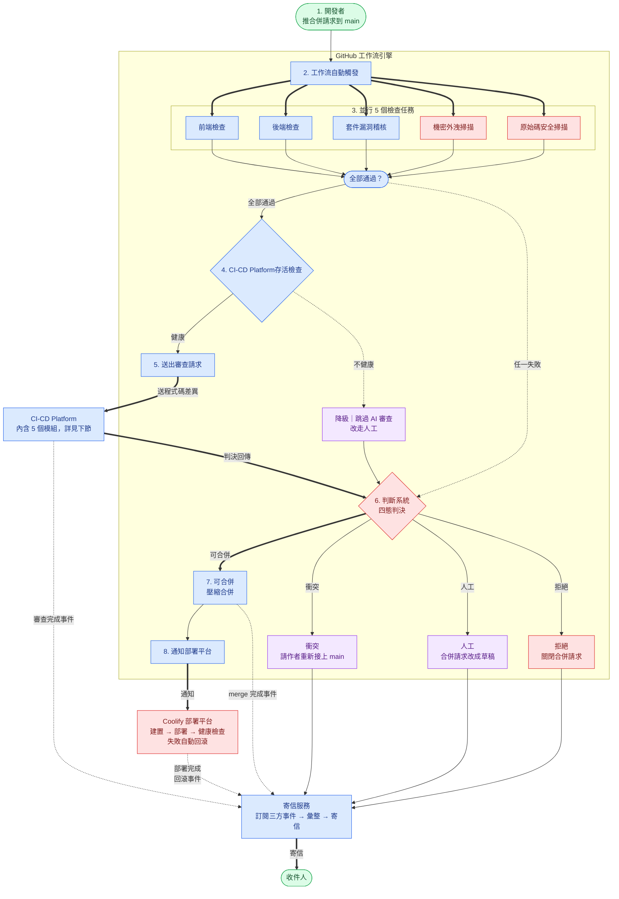
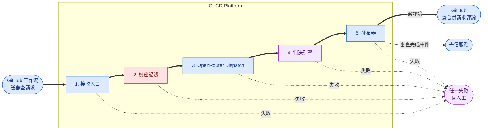
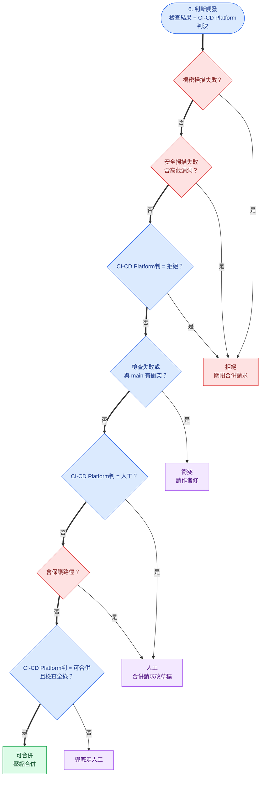
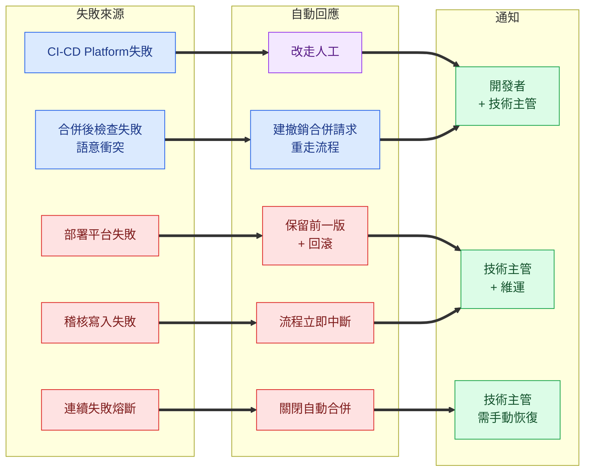

# 自動 CI/CD 流程 v1.0

> **定位**:在既有的 Coolify 自動部署之上 **新增 AI 程式碼安全審查**,把「PR → GitHub CI → CI-CD Platform 審查 → 判斷 → 自動合併 → CD 部署 → 寄報告」串成一條 **完全自動化** 的 pipeline,**三個獨立服務各司其職**。
> **三服務拆分**:
>  - 🔵 **GitHub 工作流引擎(GitHub Actions)** — 跑 CI / 打審查 API / 收 verdict / 判斷 merge / 觸發 Coolify
>  - 🔵 **CI-CD Platform** — 自建系統,內含 5 模組(接收入口 / 機密過濾 / OpenRouter Dispatch / 判決引擎 / 發布器),負責 AI code review 並產四態 verdict
>  - 🔵 **SMTP Notifier(寄信服務)** — 訂閱三方 webhook(GitHub + CI-CD Platform + Coolify),自己彙整後寄信給特定人員
> **唯一人類介入點**:收 SMTP 報告(其他全自動)。

---

## 〇、三服務職責切分

> **事件流程**:開發者推 PR → GitHub CI 5 檢查 → CI-CD Platform AI 審查 → 四態判斷 → 自動合併 → Coolify 部署 → 寄信。



**三個視角**:

| 視角 | 重點 | 說明 |
| --- | --- | --- |
| 🟢 對開發者 | 推合併請求就收工 | CI / 程式碼審查 / 合併 / 部署全部自動,結果寄信通知 |
| 🔵 對 IT | 安全審查流程解耦合 | 工作流引擎 / CI-CD Platform / 寄信服務各自獨立部署,5 檢查任務並行 |
| 🔴 ★ 對資安 / 合規 | 稽核流程狀態管理 + 保護措施 | 四態判決(合併 / 衝突 / 人工 / 拒絕),專案事件紀錄留存 |

**為什麼拆三個系統**:
- **單一職責** — GitHub 工作流引擎只做 CI/merge,CI-CD Platform 只做 AI review,SMTP Notifier 只做通知
- **可獨立部署 / 替換** — 換 LLM 提供商不影響 SMTP,換郵件服務不影響 review
- **失敗隔離** — SMTP 掛了不會卡住 merge / deploy;CI-CD Platform 掛了 GitHub 工作流引擎走 fallback(降級走人工)
- **SMTP 是長駐服務** — 比 GitHub Actions 無狀態 runner 更適合做跨階段彙整(自己有 DB 暫存事件 → 湊齊再寄)

人類**只**收信,中間 0 介入。

> **適用範圍** — 內部工具 / 中低風險服務。對外正式服務 / 金流 / 法遵敏感系統不適用(須回到 U2 人核流程)。

### CI-CD Platform 內部 5 模組

> **CI-CD Platform = 自建系統**:對 GitHub 工作流引擎而言是一個 HTTP API,內部由 5 個單一職責模組串成管線。每個模組可獨立替換,**任一模組失敗 → 統一回四態的 `manual`(人工)**。



| # | 模組 | 職責 | 失敗行為 |
| --- | --- | --- | --- |
| 1 | **接收入口** | 接請求 + 驗憑證 + 限流;對外提供 `/health` `/review` endpoint | 驗證失敗即回拒,不進後面模組 |
| 2 | **機密過濾** 🔴 | 第三道機密偵測 — 發現密碼 / 憑證仍在 → 拒收,不送進語言模型 | 命中即拒收 |
| 3 | **OpenRouter Dispatch** | 依 diff 大小 / 類型挑語言模型(OpenRouter 後端可切 Claude / GPT / Gemini …);配額 / 退路集中管理 | 重試 2 次仍失敗 → 回 `manual` |
| 4 | **判決引擎** | 呼語言模型 + 套規則庫,產四態 verdict + findings;規則改動視同程式碼 | 缺欄位 → 防呆回 `manual` |
| 5 | **發布器** | 寫 PR 評論 + 設 status check + 發審查完成事件給 Notifier | 失敗只影響通知,不影響判決(已寫稽核) |

**未來擴充**:OpenRouter Dispatch(模組 3)已可獨立部署為服務;判決引擎邏輯變複雜時可比照拆出,其餘模組同進程足夠。

---

## 一、流程詳解(GitHub Actions 視角)

### 步驟 ① — 開發者 push PR

- 從 `main` 切 feature branch(`feat/* | fix/* | refactor/*`)
- 本地完成 lint / test → push → 開 PR → `main`
- PR 標題用 commit 規範格式 `<類型>: <描述>`(AI 產出加 `(AI)` 前綴)
- **禁** `[skip ci]`

### 步驟 ② — GitHub Actions 自動觸發

`.github/workflows/ci-cd.yml`:

```yaml
on:
  pull_request:
    branches: [main]
  push:
    branches: [main]    # merge 後再跑一次確認
```

### 步驟 ③ — GitHub CI(jobs 並行)

對應 [`05-CI/00-overview`](../../Development/Harness-Engineering/docs/Design-Base/05-CI/00-overview.md) 必跑的 5 jobs:

| Job | 容忍度 | 影響 § 五 判斷 |
| --- | --- | --- |
| `frontend-test`(lint / typecheck / test / build) | **必綠** | 任一 fail → 判斷 = 不可合併 |
| `backend-test`(ruff / mypy / pytest / alembic round-trip) | **必綠** | 同上 |
| `dependency-audit`(npm audit / pip-audit) | 過渡期 `continue-on-error` | warning 入報告 |
| `secret-scan`(gitleaks) 🔴 | **必綠** | fail → 判斷 = 直接 reject(close PR) |
| `security-scan`(semgrep / trivy) 🔴 | **必綠** | `high+` → reject;`medium` → 不可合併 |

> **並行性**:5 個 job 互相無 `needs:` 依賴,**GitHub Actions 預設並行執行**(對齊 [Harness 05-CI 規範「獨立 area 必並行」](../../Development/Harness-Engineering/docs/Design-Base/05-CI/00-overview.md))。
> **命名規約**:job 名 kebab-case,對齊 `frontend-test` / `backend-test`(同上)。

完成後產出 `ci-report.json`(artifact),供步驟 ④ + ⑧ 讀取。

### 步驟 ④ — 打 CI-CD Platform 做 code review

> **CI-CD Platform = 自建系統**(內部 5 模組見 § 〇):對外是 HTTP API,內部負責驗憑證、機密過濾、挑 model、跑 review prompt、依規則庫產 verdict。
> 對 GitHub Actions 而言它就是一個 HTTP endpoint,workflow 不在乎 CI-CD Platform 後面挑了哪個 LLM。

**Workflow step**(只在 CI 全綠後跑):

```yaml
ai-review:
  needs: [frontend-test, backend-test, dependency-audit, secret-scan, security-scan]
  runs-on: ubuntu-latest
  outputs:
    verdict: ${{ steps.review.outputs.verdict }}
    review_skipped: ${{ steps.health.outputs.skipped }}
  steps:
    - uses: actions/checkout@v4

    # ─── ④.0 CI-CD Platform 健康檢查(打 /review 前先確認服務在) ───
    - name: CI-CD Platform health check
      id: health
      env:
        PLATFORM_URL: ${{ vars.CICD_PLATFORM_URL }}
      run: |
        # 5s 連線 timeout + 10s 讀取 timeout,只看 HTTP code
        code=$(curl -sS -o /dev/null -w "%{http_code}" \
                    --connect-timeout 5 --max-time 10 \
                    "$PLATFORM_URL/health" || echo "000")
        echo "CI-CD Platform /health => HTTP $code"
        if [ "$code" = "200" ]; then
          echo "skipped=false" >> $GITHUB_OUTPUT
        else
          echo "::warning::CI-CD Platform unhealthy (HTTP $code) → 跳過 AI Review,進入降級模式"
          echo "skipped=true"  >> $GITHUB_OUTPUT
        fi

    # ─── ④ 健康時才打 /review;不健康直接跳過 ───
    - name: Prepare diff
      if: steps.health.outputs.skipped == 'false'
      run: git diff origin/main...HEAD > /tmp/pr.diff
    - name: Redact secrets
      if: steps.health.outputs.skipped == 'false'
      run: gitleaks protect --staged /tmp/pr.diff
    - name: Call CI-CD Platform /review
      id: review
      if: steps.health.outputs.skipped == 'false'
      env:
        PLATFORM_URL: ${{ vars.CICD_PLATFORM_URL }}
        PLATFORM_KEY: ${{ secrets.CICD_PLATFORM_KEY }}
      run: |
        curl -X POST "$PLATFORM_URL/review" \
          -H "Authorization: Bearer $PLATFORM_KEY" \
          -H "Content-Type: application/json" \
          -d @- <<EOF > /tmp/review.json
        {
          "pr_number": ${{ github.event.pull_request.number }},
          "commit_sha": "${{ github.sha }}",
          "diff": $(jq -Rs . < /tmp/pr.diff),
          "pr_body": $(jq -Rs . <<< "${{ github.event.pull_request.body }}"),
          "rules_ref": "99-code-review/v1.0"
        }
        EOF
        echo "verdict=$(jq -r .verdict /tmp/review.json)" >> $GITHUB_OUTPUT

    # ─── ④.skip:跳過時 verdict 走 manual(等人 / 等服務恢復) ───
    - name: Mark review as manual (platform unhealthy)
      if: steps.health.outputs.skipped == 'true'
      id: review-skip
      run: |
        echo "verdict=manual" >> $GITHUB_OUTPUT
        # POST 給 SMTP Notifier(走 manual 路徑,通知 tech-lead)
        curl -X POST "${{ vars.NOTIFIER_URL }}/events" \
          -H "Content-Type: application/json" \
          -d '{
            "source":"github-actions",
            "event":"review.skipped",
            "pr_number": ${{ github.event.pull_request.number }},
            "commit_sha":"${{ github.sha }}",
            "verdict":"manual",
            "reason":"platform_unhealthy"
          }'
```

**Health check unhealthy → 走 `manual`,不直接 merge**:
- 對齊四態設計:沒 AI 把關 = 需人工介入
- PR 改成 draft + 加 label `needs-tech-lead`,SMTP 通知
- CI-CD Platform 恢復後,作者新 push 重跑流程即可

**CI-CD Platform `/health` 規格**(接收入口模組提供):
- `GET /health` → 200 + `{"status":"ok"}` 表示可服務
- 任何非 200(含 timeout / 連線失敗)→ 視為 unhealthy
- 連線 timeout 5s + 讀取 timeout 10s(避免 health check 自己卡住 CI)
- Health check **不需 API key**(只看可用性,不查業務資料)

**CI-CD Platform `/review` API 合約**(請求 → 回應):

```jsonc
// Request
{
  "pr_number": 123,
  "commit_sha": "abc1234",
  "diff": "...",          // 已過 gitleaks redact
  "pr_body": "...",
  "rules_ref": "99-code-review/v1.0"
}

// Response(CI-CD Platform 回傳給 GitHub)
{
  "verdict": "mergeable | conflict | manual | reject",   // 四態,見下表
  "verdict_zh": "可以合併 | 衝突 | 人工介入 | 不能合併",  // 中文對照,給 PR 評論用
  "reason": "string",                       // verdict 的一句話原因
  "summary": "整體評語(會貼到 PR 評論)",
  "model_used": "anthropic/claude-opus-4-7",   // 由模組 3 OpenRouter Dispatch 挑選
  "findings": [
    {
      "severity": "blocker | major | minor | nit",
      "file": "src/foo.ts",
      "line": 42,
      "rule_id": "99/04-lint-checklist#3",
      "suggestion": "改成 …"
    }
  ],
  "cost_tokens": 12345
}
```

**四態 verdict 定義**:

| verdict | 中文 | 何時回 | GitHub Actions 對應動作 |
| --- | --- | --- | --- |
| `mergeable` | 可以合併 | AI 評估無 blocker / 無保護路徑命中 | 進入步驟 ⑥ 判斷 → auto-merge |
| `conflict` | 衝突 | 偵測到語意衝突(同 schema / 同 API / 同 migration 號)或 git merge conflict | 留評論通知作者 rebase,PR 不關 |
| `manual` | 人工介入 | AI 含 blocker / 保護路徑 / CI-CD Platform 自身 unhealthy(降級) | PR 改 draft + label `needs-tech-lead`,SMTP 通知 |
| `reject` | 不能合併 | secret-scan fail / high CVE / AI 明確判 fail | PR auto-close + 留 reject 評論 |

**安全邊界**(對應 U4 § 4.4 + § 4.7):
- workflow → CI-CD Platform 只送 diff + PR body,**不**送整個 repo
- 送 CI-CD Platform 前 `gitleaks` redact;CI-CD Platform 的**機密過濾模組**是第三道(雙保險再加一)
- Token cap:input 200K / output 8K(CI-CD Platform 端強制)
- **CI-CD Platform 服務本身只有 GitHub 讀 + 評論權限,不能** 呼 GitHub merge API(merge 由步驟 ⑥ workflow 內 `auto-merge` step 處理)

### 步驟 ⑤ — API 回傳結果到 GitHub

`ai-review` step 拿到回應後做兩件事:

1. **寫 PR 評論**:
   ```yaml
   - name: Post review comment
     uses: actions/github-script@v7
     with:
       script: |
         const review = require('/tmp/review.json');
         await github.rest.issues.createComment({
           ...context.repo,
           issue_number: context.issue.number,
           body: `## 🤖 AI Review\n\n${review.summary}\n\n${formatFindings(review.findings)}`
         });
   ```

2. **設 GitHub Status Check**(讓 branch protection 看得到):
   ```yaml
   - name: Set status check
     run: gh api repos/$REPO/statuses/$SHA -f state=${{ steps.ai.outputs.state }} \
            -f context="ai-review" -f description="${{ steps.ai.outputs.verdict }}"
   ```

### 步驟 ⑥ — 判斷是否可合併(workflow 內判,四態 verdict)

**四態判決狀態機**(由上往下命中即停,最後一條兜底):



**判斷規則**(寫在 `auto-merge.yml`,可 audit 可 unit test;由上往下命中即停,不靠語言模型推理判決):

| # | 命中條件 | 最終 verdict | 動作 |
| --- | --- | --- | --- |
| 1 | `ci.secret-scan == fail` | `reject` | PR auto-close + 評論「機密外洩」 |
| 2 | `ci.security-scan == fail` 含 `high+` CVE | `reject` | PR auto-close + 評論 CVE 列表 |
| 3 | CI-CD Platform `verdict == reject` | `reject` | PR auto-close + CI-CD Platform 的 reason |
| 4 | `ci.frontend\|backend == fail` | `conflict` | 留評論「CI 失敗,請修正後 push」 |
| 5 | PR 與 main 有 git conflict | `conflict` | 留評論「請 rebase / merge main」 |
| 6 | CI-CD Platform `verdict == manual`(blocker / 保護路徑 / unhealthy) | `manual` | PR 改 draft + label `needs-tech-lead` |
| 7 | PR 改動含 **保護路徑**(見 § 二) | `manual` | 同上 |
| 8 | CI-CD Platform `verdict == mergeable` 且 CI 全綠 | `mergeable` | **auto-merge** ✅ |
| 9 | 上述皆無命中(例:CI 全綠但 verdict 缺欄位) | `manual` | 防呆,走人工 |

> **核心對應**:**CI-CD Platform 的 verdict 是建議**,workflow 步驟 ⑥ 是 **最終判決**。CI-CD Platform 不該因為 secret-scan / security-scan(CI 才知道)的結果改 verdict — 那些由 workflow 判。

**自動合併 step**(依四態分派):

```yaml
auto-merge:
  needs: ai-review
  steps:
    - name: Compute final verdict
      id: final
      env:
        PLATFORM_VERDICT: ${{ needs.ai-review.outputs.verdict }}
      run: |
        # 保護路徑檢查(可覆寫 CI-CD Platform 的 mergeable)
        if git diff --name-only origin/main...HEAD \
            | grep -qE '^(docs/Design-Base/|\.github/workflows/|infra/|.*migrations/)'; then
          echo "verdict=manual" >> $GITHUB_OUTPUT
        else
          echo "verdict=$PLATFORM_VERDICT" >> $GITHUB_OUTPUT
        fi
    - name: Action by verdict
      run: |
        case "${{ steps.final.outputs.verdict }}" in
          mergeable)
            gh pr merge ${{ github.event.pull_request.number }} --squash ;;
          conflict)
            gh pr comment ${{ github.event.pull_request.number }} \
                --body "⚠️ 與 main 有衝突,請 rebase 後重 push" ;;
          manual)
            gh pr ready  ${{ github.event.pull_request.number }} --undo  # 改 draft
            gh pr edit   ${{ github.event.pull_request.number }} --add-label needs-tech-lead ;;
          reject)
            gh pr close  ${{ github.event.pull_request.number }} \
                --comment "❌ 不接受此變更(理由見 AI Review 評論)" ;;
        esac
```

### 步驟 ⑦ — GitHub 完成 workflow → 觸發 CD

`gh pr merge` 觸發 `push: main` event,workflow 再跑一次 CI:

- CI 仍綠 → 發 Coolify webhook(image tag = commit SHA,**禁** `latest`)
- Coolify pull → build → deploy → health check
- CD 結果寫入 `cd-report.json`(artifact)

### 步驟 ⑧ — SMTP Notifier 寄報告(**獨立服務,不在 GitHub Actions 內**)

> **本步驟由獨立的 SMTP Notifier 服務處理**,GitHub Actions / CI-CD Platform / Coolify 三方各自把結果 POST 給 Notifier,**Notifier 自己彙整再寄**。

**SMTP Notifier 端要做的事**:

1. 訂閱三方 webhook(對 Notifier 而言全部是「事件來源」):
   - 來自 **GitHub Actions** → CI 結果 + merge 結果
   - 來自 **CI-CD Platform** → AI review verdict + findings
   - 來自 **Coolify** → deploy + health check + rollback
2. 內部用 PR# 當 key 暫存事件(short-lived DB / Redis)
3. 湊齊條件 → 依 § 三 通知策略決定收件人 → 彙整內容寄 SMTP

**事件接口(三方各 POST 一個 JSON 給 Notifier)**:

```jsonc
// 來自 GitHub Actions(CI 完成或 merge 完成)
POST /events
{
  "source": "github-actions",
  "event": "ci.completed | merge.done",
  "pr_number": 123,
  "commit_sha": "abc1234",
  "result": "pass | fail",
  "jobs": { "frontend": "ok", "backend": "ok", ... },
  "merged_by": "auto-gate",
  "ts": "2026-05-19T10:23:00Z"
}

// 來自 CI-CD Platform(AI review 完成)
POST /events
{
  "source": "cicd-platform",
  "event": "review.done",
  "pr_number": 123,
  "commit_sha": "abc1234",
  "verdict": "mergeable | conflict | manual | reject",
  "blocker_count": 0,
  "major_count": 1,
  "model_used": "anthropic/claude-opus-4-7",
  "summary_url": "https://cicd-platform.../reviews/123",
  "ts": "2026-05-19T10:24:00Z"
}

// 來自 Coolify(deploy 完成或 rollback)
POST /events
{
  "source": "coolify",
  "event": "deploy.done | rollback.triggered",
  "pr_number": 123,                 // Coolify 從 commit message 或 webhook 解析帶上
  "commit_sha": "abc1234",
  "status": "success | fail",
  "healthcheck": "ok | fail",
  "ts": "2026-05-19T10:26:00Z"
}
```

**Notifier 彙整邏輯**:
- 收到 `review.done` + `ci.completed` + `merge.done` + `deploy.done` 全套 → 寄「完整報告」
- 收到任一 `fail` / `reject` / `manual` → 立即寄「告警 / 等修」信
- 超時(例 30 分仍未湊齊)→ 寄部分報告 + 標註 「<某階段> 未回報」

**寄出範例**:
```
[CI/CD] PR#123 - PASS / 部署成功

CI 5 jobs:      ✅ 全綠(2m 14s)
AI Review:      ✅ 0 blocker / 1 minor(已留評論)
Merge:          ✅ squashed by auto-gate at 2026-05-19 10:23
Deploy:         ✅ image abc1234 → healthcheck ok at 10:25

Audit:          https://audit.df-recycle.com.tw/pr/123
PR:             https://github.com/df-recycle/repo/pull/123
```

**為什麼 SMTP 是獨立服務、不放 GitHub Actions、也不放 CI-CD Platform**:
- **GitHub Actions** 是無狀態 runner,跨階段彙整要靠 artifact 串接很脆弱;且 runner 死掉信就漏
- **CI-CD Platform** 專心做 AI review,塞通知邏輯會打亂單一職責
- **獨立 Notifier** 有自己的 DB 可暫存事件,湊齊或超時都能處理;通知模板 / 收件人 / 黑白名單變動只動 Notifier,不動 workflow 也不動 CI-CD Platform

---

## 二、保護路徑(永遠走 `manual`,需人工介入)

即使全自動,以下路徑變更仍會在 § 一.⑥ 強制走 `manual`:

- `docs/Design-Base/**` — 規範本身
- `.github/workflows/**` — CI/CD 流程本身
- `infra/**` / `coolify/**` — 部署設定
- `**/migrations/**` — DB schema
- PR 標題含 `SECURITY:` / `BREAKING:`

**理由**:這幾類錯了會炸整條流程或炸 prod,全自動 merge 風險不對稱。

---

## 三、通知策略(SMTP 唯一規則)

避免信箱噪音 — **只** 在以下情境寄信:

| 事件 | 收件人 | 內容 |
| --- | --- | --- |
| PR 可合併 + 部署成功 | assignee + reviewer | 單封摘要,標題 `[CI/CD] PR#123 - PASS` |
| PR 衝突(conflict) | assignee | CI 失敗 / 與 main 衝突,請修正後重 push |
| PR 人工(manual) | assignee + reviewer | CI / AI / 判斷理由 |
| PR 拒絕(reject) | assignee + reviewer + tech-lead | 同上 + reject 原因(secret 外洩 / high CVE / AI fail) |
| 保護路徑觸發 | tech-lead | 路徑清單 + PR 連結 |
| CD 部署失敗 | tech-lead + DevOps | 健康檢查結果 + Coolify log 連結 |
| 自動 Rollback 觸發 | tech-lead + DevOps + reviewer | from_sha / to_sha / 原因 |
| 主管週報(排程,週一) | 主管 | 過去一週 PR 統計 + 異常 |

**禁**:每次 push / 每個 lint warning 都寄。

---

## 四、衝突與失敗處理

**失敗 → 自動回應 → 通知**(5 種失敗來源各自的處理路徑):



### 4.1 PR 與 main 衝突

- workflow **不**自動解衝突 → PR UI 顯示衝突 → 作者 rebase / merge 後重 push:
  ```bash
  git fetch origin main
  git rebase origin/main
  # 解衝突 → git add → git rebase --continue
  git push --force-with-lease
  ```

### 4.2 CI-CD Platform 失敗

- 重試 2 次 → 仍失敗 → 判斷 = **`manual`(人工)**(無 AI 意見不敢自動 merge)
- SMTP 通知 tech-lead

### 4.3 Merge 後 `push: main` CI fail(語意衝突)

- 觸發告警 → 自動建立 revert PR(`git revert <sha>`)→ 重走流程
- SMTP 即時通知 tech-lead

### 4.4 CD 部署失敗

- Coolify 保留前一版 container → 自動觸發 Coolify rollback API
- SMTP 通知 tech-lead + DevOps

### 4.5 熔斷(連續失敗)

- 觸發任一條件 → workflow 自動關閉 auto-merge(設 repo variable `AUTO_MERGE_ENABLED=false`):
  - 過去 **1 小時**內 deploy fail **≥ 3 次**,或
  - 過去 **24 小時**內自動 rollback **≥ 2 次**
- 後續 PR 一律走 `manual`,直到 tech-lead 手動 resume

---

## 五、Audit Trail(對應 U4 § 4.8 ★)

**每一步**寫入獨立 Audit DB(**禁** 與業務 DB 同庫),全事件 **append-only(只增不改)**:

```json
{
  "event_id": "uuid",
  "ts": "2026-05-19T10:23:45Z",
  "pr_number": 123,
  "commit_sha": "abc1234",
  "stage": "ci | ai-review | judgement | merge | deploy | notify | rollback",
  "actor": "github-actions[bot] | cicd-platform | auto-merge-step | coolify",
  "result": "pass | hold | reject | fail | success",
  "matched_rule_id": "auto-merge#row3",   // judgement 階段必填
  "report_uri": "artifact://... 或 s3://...",
  "cost_tokens": 12345                    // ai-review 階段必填
}
```

- Retention ≥ **2 年**(全自動流程,代償人類缺位)
- Audit 寫入失敗 → workflow fail-fast(audit 缺失 = 該次 PR 不允許 merge,對應 § 四 失敗來源 F5)

---

## 六、6 條 Coolify 合規對照

| 合規通則 | 本流程落點 |
| --- | --- |
| 1. 容器與映像 | 步驟 ⑦ image tag = commit SHA(禁 `latest`) |
| 2. Secret 管理 | GitHub Secrets + 步驟 ④ gitleaks redact + CI-CD Platform 機密過濾模組 |
| 3. 權限與隔離 🔴 | CI-CD Platform 只有讀權限,不能 merge;唯一 merge 來源 = `auto-merge` step |
| 4. 可觀測性 | § 五 Audit + Coolify → Seq stdout |
| 5. CI/CD 🔴 | 步驟 ② + ⑦(push → auto deploy);Prompt 改視同 code |
| 6. Audit Trail 🔴 | § 五 — retention ≥ 2 年 |

完整 checklist 見 [`Coolify-Compliance-Mapping.md`](../20260507-Harness-Engineering-BreakDown-v1.0/Coolify-Compliance-Mapping.md)。

---

## 七、與 Harness U3 / U4 對照(本流程是最小落地版)

本流程是 [U3 ② 設計 Review Agent](../20260507-Harness-Engineering-BreakDown-v1.0/U3-Agentic-Engineering.md) 的最小可行落地。完整 6 Agent 架構暫不導入,只先做 ② Review。

| Harness 元件 | 本流程對應 |
| --- | --- |
| **U3 ② 設計 Review Agent** | 步驟 ④「打 CI-CD Platform」 |
| **U3 ⑤ 維運/告警 Agent** | § 四.5 熔斷 + § 三 SMTP 告警 |
| **U3 ⑥ 主管報告 Agent** | § 三 排程週報 |
| **U3 Leader / Tool Gateway** | (本流程暫不導入,workflow 本身就是 orchestrator) |
| **U4 § 4.1 Prompts** | CI-CD Platform 判決引擎的 prompt 版本鎖 |
| **U4 § 4.2 Tools** | API 限定能呼 GitHub 評論 + status,**不能** merge |
| **U4 § 4.4 Sandbox** 🔴 | 步驟 ④ diff-only + redact + runner 隔離 |
| **U4 § 4.5 Tests / CI** | 步驟 ③ 5 jobs |
| **U4 § 4.6 Logs / Trace** | § 五 Audit + Coolify → Seq |
| **U4 § 4.7 Hooks / Guardrails** | 步驟 ⑥ 判斷規則 + § 二 保護路徑 |
| **U4 § 4.8 Audit** 🔴 | § 五 |

**未來擴充**:當需要加 ③ 測試 Agent / ⑤ 維運 Agent / ⑥ 主管報告 Agent 時,可升級為 [Control Plane 事件驅動版本](#)(另立 `workflow-v2.0.md`)。

---

## 八、自我檢核

- [ ] `.github/workflows/ci-cd.yml` 含 § 一 8 個步驟(② ~ ⑧)
- [ ] CI-CD Platform URL + Key 走 GitHub Variables / Secrets(`CICD_PLATFORM_URL` / `CICD_PLATFORM_KEY`)
- [ ] 步驟 ④ 送出前過一次 gitleaks redact(即使 secret-scan 已過也要);CI-CD Platform 機密過濾模組為第三道
- [ ] CI-CD Platform 服務本身**不能** 呼 GitHub merge(權限分離,唯一 merge 來源 = `auto-merge` step)
- [ ] 步驟 ⑥ 四態判斷規則寫在 workflow yaml(可 review、可 test)
- [ ] § 二 保護路徑列表落地,且這些路徑強制走 `manual`
- [ ] § 三 SMTP 通知策略:不寄每次 push,只寄有意義的事件
- [ ] § 五 Audit 寫獨立 DB、append-only、retention ≥ 2 年,寫失敗 fail-fast
- [ ] § 四.5 熔斷雙條件落地(1h deploy fail ≥ 3 **或** 24h rollback ≥ 2 → 自動關 auto-merge)
- [ ] 整條流程中,人類只在 § 一.⑧(收 CI + CD 報告)出現

---

## 九、版本

- **v1.0(2026-05-19)** — 首版,線性 GitHub Actions pipeline:
  - § 〇 三服務職責切分(主流程 mermaid 圖)+ CI-CD Platform 內部 5 模組拆解(接收入口 / 機密過濾 / OpenRouter Dispatch / 判決引擎 / 發布器)
  - § 一 完整 workflow 範例(yaml snippet 可直接抄)
  - § 一.④ CI-CD Platform `/review` 合約(request / response schema)
  - § 一.⑥ 四態判決狀態機(mergeable / conflict / manual / reject)
  - § 二 保護路徑(規範 / workflow / infra / migration 強制走 `manual`)
  - § 四 衝突 / 失敗 / 熔斷處理(1h deploy fail ≥ 3 或 24h rollback ≥ 2)
  - § 五 Audit append-only,retention 2 年
  - § 七 標註本流程 = U3 ② Agent 最小落地,完整 Control Plane 留 v2.0
