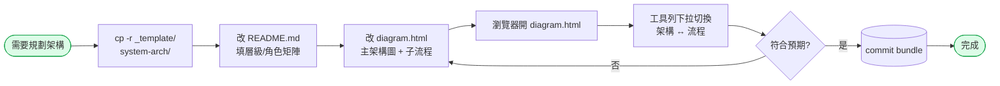

# diagrams — 架構圖 / 子流程圖 模板

> **用途**:以 [Mermaid](https://mermaid.js.org/) 製作「**1 張主架構圖 + N 張子流程圖**」的 bundle,圖檔本身就是 HTML(雙擊即看,無 build / 無 npm),搭配 `README.md` 做 [Breakdown 文字拆解](../../../../../Architecture/20260507-Harness-Engineering-BreakDown-v1.0/README.md)。
>
> **核心觀念**:**架構圖 ≠ 流程圖**。架構圖回答「**系統長什麼樣?**」(層級 / 邊界 / Owner);流程圖回答「**這條業務怎麼跑?**」(穿過架構圖的哪些節點)。兩者放同一個 HTML,工具列切換。
>
> **不在範圍**:UML(class / sequence / state)— 模板技術上支援,但目前**不**列入規範範例。
>
> **自動化**:本模板已包成 Claude Code skill(`/create-arch-diagram`),自動 cp bundle + 改名 + 衝突偵測。Skill 定義在 [`Template/Skills/create-arch-diagram/SKILL.md`](../../../Skills/create-arch-diagram/SKILL.md)。手動 cp 跟跑 skill 等價,選一即可。

---

## 狀態流程(本模板的使用循環)



---

## 結構(bundle 形式)

```
diagrams/
├── README.md                  # 本檔
├── _template/                 # 模板 bundle(cp -r 整個資料夾)
│   ├── README.md              # Breakdown:層級 / 角色矩陣 / 流程清單 / 學習路徑
│   └── diagram.html           # 1 張主架構 + N 張子流程,工具列切換
└── <concrete>/                # 實際的圖(由 _template/ cp 出來,例 system-arch / payment-arch)
    ├── README.md
    └── diagram.html
```

### 為什麼是 bundle 而不是單檔

- **架構決策的脈絡**通常一份圖說不完(誰負責 / 為什麼這樣切 / 角色該讀什麼) → 需要 `README.md`
- **架構 + 流程同檔**才不會 drift(改架構節點名稱時,流程裡的對應節點也要同步,放同檔比較容易維護)
- **未來 skill 化**只要 cp 整個 `_template/` 就帶走完整結構

---

## 規則

- 一個 architecture topic = 一個資料夾(`<topic>/` 內含 `README.md` + `diagram.html`)
- **禁** `.drawio` / `.png` 作主要來源(可作匯出產物,**不可**取代 HTML 原始檔)
- 主架構圖 1 張(`id="arch"`);流程圖 N 張(`id="flow-XXX"`),全部寫在同一個 `diagram.html` 內
- 每條流程的 `data-desc` **必須**寫「對應架構節點」+「為什麼存在」(避免架構改了流程找不到對應)
- 跨模組共用的圖 → 放本資料夾;單版本一次性圖 → 放 `docs/Tasks/v{X.Y.Z}/diagrams/`(同樣 bundle 形式)

---

## 用法

### 新增一份架構 bundle

#### 方式 A:跑 skill(推薦)

```
/create-arch-diagram
# → 輸入名稱(kebab-case,例:system-arch)
# → skill 偵測衝突 → cp _template/ 到 docs/Arch/diagrams/<name>/ → 改 <title> + <h1>
```

#### 方式 B:手動 cp

```
cp -r _template/ system-arch/
```

#### cp 完成後(兩種方式相同)

```
1. 改 <name>/README.md:填層級表 + 角色矩陣 + 流程清單
2. 改 <name>/diagram.html:
   - 改 <script id="arch"> 內容(主架構圖)
   - 改 <script id="flow-auth"> / <script id="flow-deploy"> 內容
   - 需要新增流程?複製一份 <script type="text/plain"> 區塊,改 id / data-label / data-desc
3. 瀏覽器開 <name>/diagram.html,工具列下拉切換驗證
4. commit <name>/
```

### `diagram.html` 內如何新增子流程

```html
<script type="text/plain" id="flow-payment" data-label="④ 付款流程" data-kind="flow"
        data-desc="<strong>對應架構節點:</strong>User → API → Pay → DB。<strong>為什麼:</strong>Stripe webhook idempotency 處理。">
flowchart TB
  Start([結帳]) --> ...
</script>
```

四個 attribute 規約:

| Attribute | 必填 | 用途 |
| --- | --- | --- |
| `id` | ✅ | `arch`(主架構)或 `flow-<topic>`(子流程) |
| `data-label` | ✅ | 工具列下拉顯示文字(建議帶編號:① / ② / ③ ...) |
| `data-kind` | ✅ | `architecture` 或 `flow`,下拉自動分組 |
| `data-desc` | 建議 | 右下小字說明;**對應架構節點 + 為什麼存在** |

### 內嵌到 Markdown

GitHub 原生支援 Mermaid code block。若同份內容需在 Markdown + HTML 兩處出現:

````markdown

````

> **HTML 為單一真相來源**;Markdown 內的 mermaid block 從 HTML 同步(避免 drift)。

---

## 模板能力(`diagram.html`)

| 功能 | 說明 |
| --- | --- |
| 圖表切換 | 工具列下拉,架構 / 流程自動分組,選哪張渲染哪張 |
| 圖說對應 | 右下浮窗顯示 `data-desc`(對應架構節點 / 為什麼) |
| 主題切換 | Light / Dark / Neutral / Forest;預設依系統 `prefers-color-scheme` |
| 字體大小 | 預設 16px,可調 10–32px(中文圖預設 ≥ 14px 避免糊) |
| 字體 fallback | `Noto Sans TC` → `PingFang TC` → `Microsoft JhengHei` → system-ui |
| 匯出 | 複製 SVG / 下載 SVG / 下載 PNG(2x 高解析,檔名帶 id) |
| 離線 | **不離線**;載 `cdn.jsdelivr.net` mermaid@11(企業內網需自建鏡像) |

---

## Mermaid 語法 cheatsheet

### 架構圖(用 `flowchart TB` + subgraph)

```
flowchart TB
  subgraph EDGE ["Edge — Owner: DevOps"]
    Proxy[Caddy]
  end
  subgraph APP ["Application — Owner: Backend"]
    API[FastAPI]
  end
  subgraph DATA ["Data"]
    DB[(PostgreSQL)]
  end
  Proxy --> API --> DB

  classDef external fill:#fef3c7,stroke:#d97706
  class Proxy external
```

重點:**每個 subgraph 標 Owner**,**用 classDef 區分外部 / cross-cutting / critical**。

### 流程圖(用 `flowchart TB` + 決策菱形)

```
flowchart TB
  Start([開始]) --> Step1[/接收輸入/]
  Step1 --> Cond{條件?}
  Cond -->|是| A[動作 A]
  Cond -->|否| B[動作 B]
  A --> Save[(寫 DB)]
  B --> Save
  Save --> End([結束])

  classDef terminal fill:#dcfce7,stroke:#16a34a
  classDef decision fill:#fee2e2,stroke:#dc2626
  class Start,End terminal
  class Cond decision
```

形狀速記:

| 寫法 | 樣式 | 適用 |
| --- | --- | --- |
| `A[文字]` | 方框 | 模組 / 服務 / 動作步驟 |
| `A(文字)` | 圓角 | 流程子步驟 |
| `A([文字])` | 體育場 | 起點 / 終點 / Actor |
| `A{文字}` | 菱形 | 條件分支 |
| `A[(文字)]` | 圓柱 | 資料庫 |
| `A[/文字/]` | 平行四邊形 | I/O / 外部介面 |

連線:

- `A --> B`:實線箭頭
- `A -.-> B`:虛線(非同步 / 事件 / 跨邊界)
- `A ==> B`:粗線(主資料流)
- `A -->|標籤| B`:帶標籤

---

## 常見問題

| 問題 | 解法 |
| --- | --- |
| 中文糊 / 太小 | 工具列字體調 ≥ 16px;PNG 匯出已 2x 解析 |
| 節點換行 | `A["第一行<br>第二行"]`(需 `htmlLabels: true`,模板預設開) |
| 上傳到 confluence / notion | 「複製 SVG」貼入即可(或下載 PNG) |
| 切換主題後文字看不清 | Dark 主題會自動切到深色背景;PNG 匯出也帶對應背景 |
| 沒網路 → 載不到 mermaid | 模板用 `cdn.jsdelivr.net`;企業內網需自建鏡像或下載 `mermaid.min.js` 改 local path |
| 想看官方語法 | https://mermaid.js.org/intro/ |

---

## 與其他資料夾的關係

| | 本資料夾 | `docs/Arch/adr/` | `docs/Design-Base/` | `docs/Tasks/` |
| --- | --- | --- | --- | --- |
| 內容 | 主架構 + 子流程 + Breakdown 文字 | 決策紀錄 | 實作規範 | 單版本任務 |
| 變動 | 低(架構變才動) | 不可變(改決策另開) | 低 | 高 |
| 對象 | 全公司(高層 / PM / 工程 / DevOps) | 架構師 / Reviewer | Agent / 實作者 | Agent / Orchestrator |

> 規則優先序見 `docs/Arch/README.md`:`docs/Design-Base/* > docs/Arch/* > AGENTS.md / CLAUDE.md > docs/Tasks/*`
